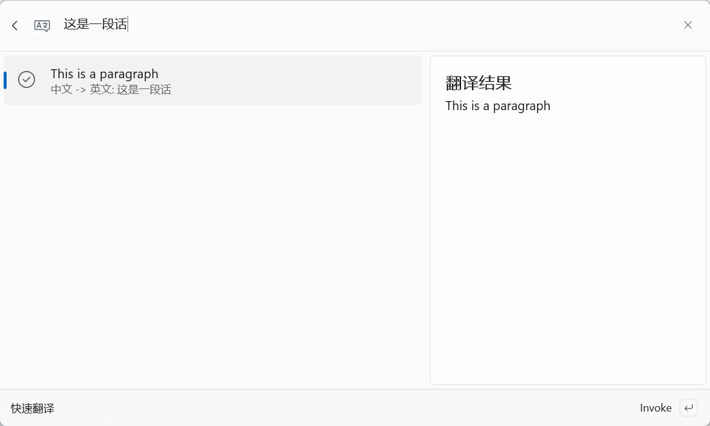
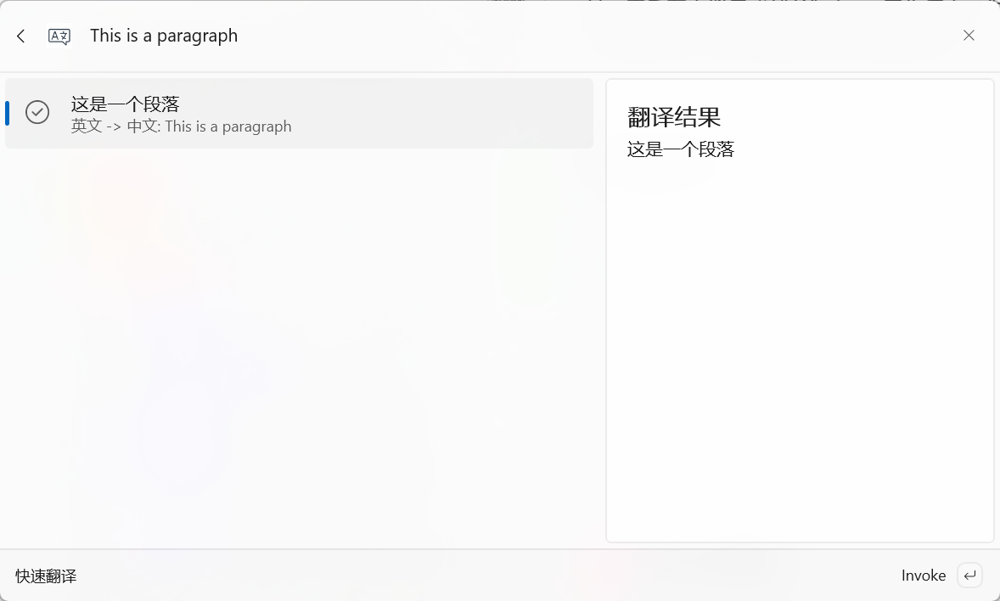

<div align="center">
  <h1>TranslationExtension</h1>
  <p>专为 PowerToys 深度定制的极速翻译扩展</p>

  <p>
    
    
    
    
  </p>
  <p>
    
    
    
  </p>
</div>

这是一个专为 PowerToys 深度定制的翻译扩展工具。它旨在无缝集成到 Windows 工作流中，为开发者提供极速、简洁且高效的文本翻译体验。

---

## 界面展示

| 中文转英文 | 英文转中文 |
| :---: | :---: |
|  |  |


## 核心特性

- **极速响应**：基于 .NET 9 高性能运行时，翻译请求毫秒级响应。
- **PowerToys 集成**：深度适配 PowerToys 插件体系，集成度高。
- **智能感应**：支持中英文自动检测与互译，无需手动切换源语言。
- **灵活配置**：内置统一的设置面板，支持多种 API 凭证管理（目前已完善支持百度翻译）。
- **现代 UI**：采用 WinUI 3 框架，完美融入 Windows 11 设计风格，支持深色/浅色模式。

## 技术栈

- **语言**: [C# 13](https://learn.microsoft.com/dotnet/csharp/)
- **框架**: [.NET 9.0](https://dotnet.microsoft.com/download/dotnet/9.0)
- **UI 框架**: [Windows App SDK / WinUI 3](https://learn.microsoft.com/windows/apps/winui/winui3/)
- **API 集成**: RESTful API (HttpClient)

## 环境要求

- **操作系统**: Windows 10 version 19041.0 或更高版本
- **开发工具**: [Visual Studio 2022](https://visualstudio.microsoft.com/vs/) (需安装 "Windows 应用程序开发" 工作负荷)
- **运行时**: [.NET 9.0 SDK](https://dotnet.microsoft.com/download/dotnet/9.0)

## 快速开始

### 克隆代码仓库
```powershell
git clone https://github.com/weimin96/TranslationExtension.git
cd TranslationExtension
```

### 生成自签名证书 (仅当需要重新生成时)

管理员打开 PowerShell，执行以下命令生成 `.pfx` 和 `.cer` 文件：

```powershell
# 1. 创建并导出 PFX 证书
$cert = New-SelfSignedCertificate -Type Custom -Subject "CN=weimin96" -KeyUsage DigitalSignature -FriendlyName "TranslationExtension Cert" -CertStoreLocation "Cert:\CurrentUser\My" -TextExtension @("2.5.29.37={text}1.3.6.1.5.5.7.3.3", "2.5.29.19={text}");
$password = ConvertTo-SecureString -String "1234" -Force -AsPlainText;
Export-PfxCertificate -Cert $cert -FilePath "TranslationExtension.pfx" -Password $password;

# 2. 导出 CER 证书 (用于导入受信任根证书)
Export-Certificate -Cert $cert -FilePath "TranslationExtension.cer"
```

> [!TIP]
> 默认密码为 `1234`。如果更改了密码，请同步更新 `TranslationExtension.csproj` 中的 `PackageCertificatePassword`。

### 编译与运行 (开发者专用)

1.  使用 **Visual Studio 2022** 打开 `TranslationExtension.sln`。
2.  确认已安装所需的 .NET 9.0 SDK 和 Windows App SDK 工作负载。
3.  将 `TranslationExtension` 项目设为 **启动项目**。
4.  选择编译配置为 `Release` 或 `Debug`。
5.  按 `F5` 启动调试，或通过 `生成 > 发布` 进行 MSIX 打包。

### 安装指南 (用户专用)

1.  **安装签名证书** (首次安装必选):
    - 右键点击 `.msix` 安装包 -> **属性** -> **数字签名**。
    - 选择签名列表中的项目 -> **详细信息** -> **查看证书** -> **安装证书**。
    - 存储位置选择：**本地计算机**。
    - 将证书放入：**受信任的人** (Trusted People) 存储区。
2.  **双击安装**:
    - 证书安装成功后，双击 `.msix` 文件即可直接安装。

### 卸载

如果您需要卸载此扩展，可以使用 PowerShell：
```powershell
Get-AppxPackage TranslationExtension | Remove-AppxPackage
```


## 翻译提供商配置

在使用翻译功能之前，需要至设置页面配置服务商凭证：

### 百度翻译 (Baidu)
1. 注册并登录 [百度翻译开放平台](http://api.fanyi.baidu.com/)。
2. 在 **开发者信息** 中获取您的 `App ID` 和 `Secret Key`。
3. 打开本扩展的 **Settings (设置)** 页面。
4. 选择 **Baidu** 提供商，填入对应的凭证并保存。

> [!TIP]
> 百度翻译为新用户提供一定额度的每月免费调用字数，适合个人开发者使用。

## 项目结构

```text
TranslationExtension/
├── TranslationExtension/          # 核心插件逻辑
│   ├── Assets/                    # 图标与静态资源
│   ├── Pages/                     # WinUI 页面 (设置与主界面)
│   ├── TranslationService.cs      # API 请求核心逻辑
│   ├── TranslationSettings.cs     # 配置模型定义
│   └── SettingsManager.cs         # 本地持久化管理
├── Directory.Build.props          # 全局构建配置
└── TranslationExtension.sln       # 解决方案入口
```

## 参与贡献

我们非常欢迎来自社区的贡献！
1. Fork 本仓库。
2. 创建您的特性分支 (`git checkout -b feature/AmazingFeature`)。
3. 提交您的更改 (`git commit -m 'Add some AmazingFeature'`)。
4. 推送到分支 (`git push origin feature/AmazingFeature`)。
5. 开启一个 Pull Request。

## 开源协议

本项目基于 **MIT** 协议开源。详情请参阅 [LICENSE](LICENSE) 文件。
